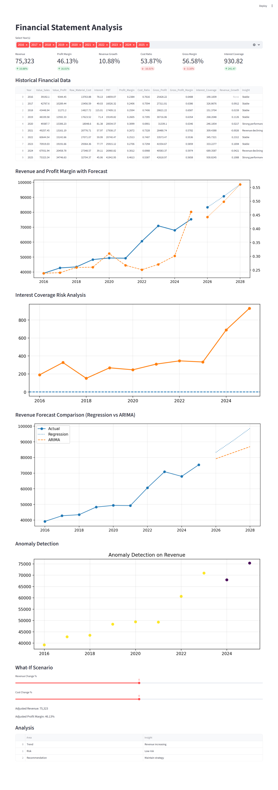

# Financial Statement Analysis 

Financial statement analysis project using Python. Covers data transformation, key financial metrics such as revenue growth and profit margin, and simple forecasting, presented through a structured and interactive dashboard.This project uses a sample financial dataset to demonstrate core financial analysis concepts and modeling techniques.

## Dashboard Preview



## Live App

[Click here to view the dashboard](https://financial-statement-analysis-python-mxpwhi5yuk3icbgcbcy5ja.streamlit.app/)

 ## Key Features
- Data transformation from raw financial statements
- Revenue and Profit Margin analysis
- YOY growth analysis
- Forecasting using regression models  
- Cost and efficiency metrics  
- Interest Coverage Ratio (financial risk indicator)  
- Risk-based visualization with threshold analysis  
- Automated business insights generation
- Interactive dashboard using Streamlit

## Tech Stack

- Excel (data source)
- Python  
- Pandas  
- NumPy  
- Matplotlib  
- Scikit-learn  
- Streamlit

## Forecasting Approach

The project uses two simple forecasting approaches to understand future revenue trends:

- **Regression-based forecasting** is used to capture the overall growth trend over time. It provides a smooth and easy-to-interpret projection of how revenue is expected to evolve.

- **ARIMA (time-series model)** is used to account for year-to-year variations and short-term patterns in the data.

Both models are used together to compare results.  
If both forecasts align, it increases confidence in the prediction.  
If they differ, it highlights potential uncertainty or variability in future performance.

## Key Insights

- Revenue shows a consistent upward trend over the years  
- Profit margins are stable with gradual improvement  
- Increasing cost ratio in some periods indicates potential margin pressure  
- Interest coverage highlights the company’s ability to manage debt obligations  
- Risk analysis shows periods of financial stress when coverage drops below safe thresholds  
- Forecast indicates continued growth in revenue and stable profitability

## How to Run

```bash
pip install -r requirements.txt
streamlit run app.py

